author: Santiago Domínguez Gómez
summary: Guía para bastionar router ASUS RT-AX95Q
id: bastionado-router-asus-rt-ax95q
categories: Seguridad,Redes,Configuración
environments: Web
status: Published
feedback link: 

# GUÍA HARDENING ROUTER ASUS RT-AX95Q

## Introducción

Para elaborar esta guía hemos seguido las mejores prácticas de seguridad identificadas en los recursos técnicos disponibles. A continuación se muestran los pasos que hemos seguido para bastionar este router:

## Actualización de firmware
Debemos verificar que el router tenga la versión más reciente del **firmware**, ya que las actualizaciones suelen corregir vulnerabilidades y mejorar la estabilidad y seguridad.

Para ello accedemos a **Administración > Firmware Upgrade** y pulsamos en el botón en **Check Update** para comprobar si hay actualizaciones disponibles.

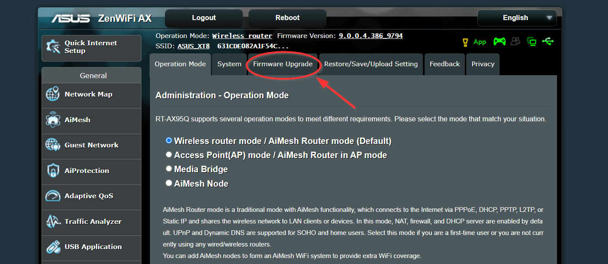

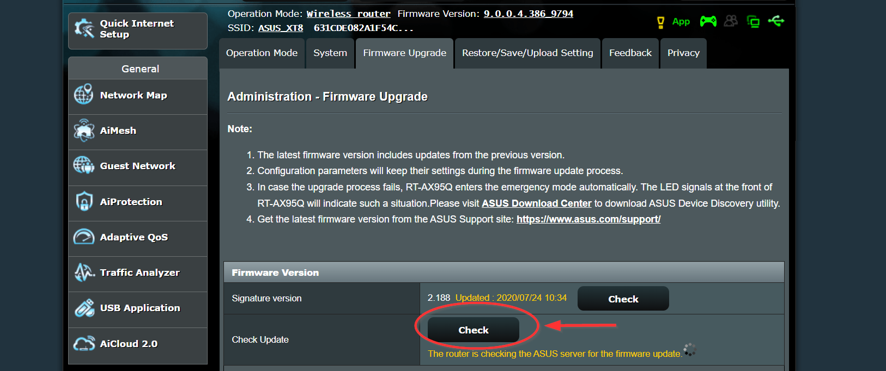

## Gestión de credenciales y acceso administrativo
Ahora nos movemos a **Administration > System**.

En primer lugar cambiamos el **usuario** y **contraseña** predeterminados del **panel administrativo**.

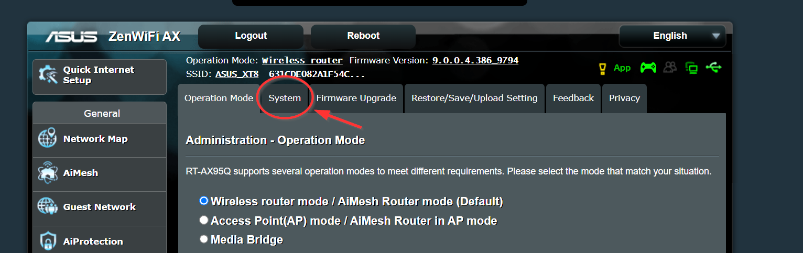

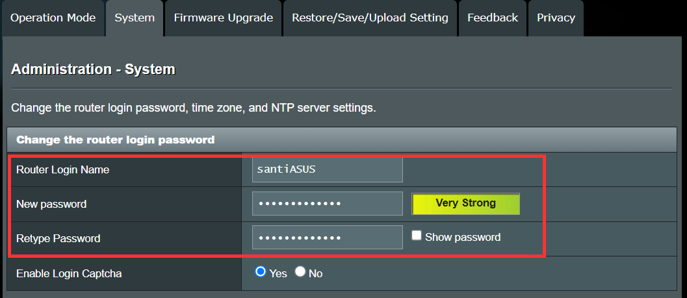

**Nota:** Usar contraseñas de **mínimo 12 caracteres** con combinación de **mayúsculas, números y símbolos**.

Ahora cambiaremos el **método de autenticación** a **HTTPS** para añadir una capa de cifrado a la conexión al acceder a la administración del router. 

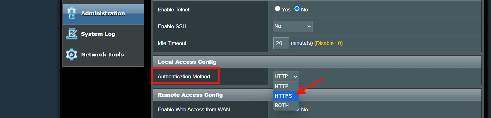

Opcionalmente podemos cambiar el **puerto de administración HTTPS** para mayor seguridad.

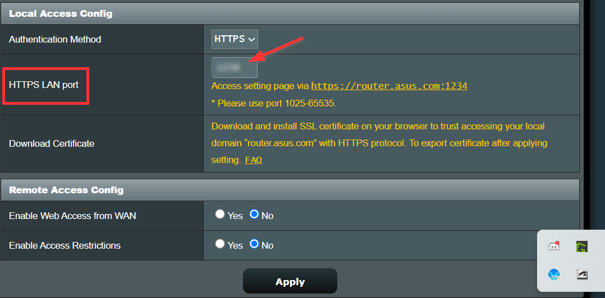

Si no necesitamos gestionar el router desde fuera de la red local podemos **deshabilitar el acceso remoto (WAN Access).**

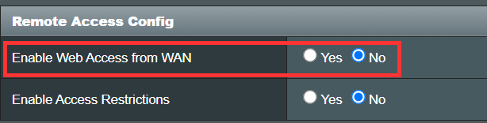

También podemos deshabilitar **Telnet** y **SSH** en caso de no necesitarlos.

Finalmente pulsamos **Apply** para guardar todos los cambios.

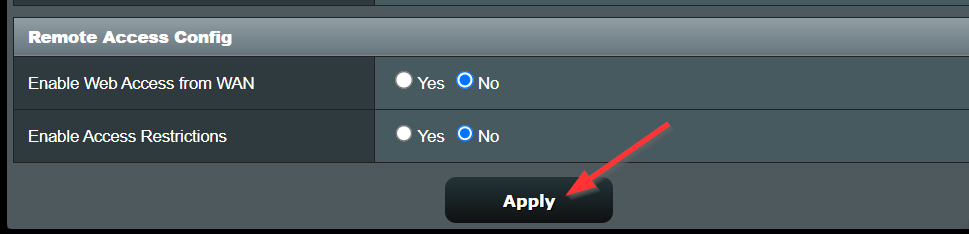

## Encriptación inalámbrica
Ahora nos desplazamos a **Wireless > General**.

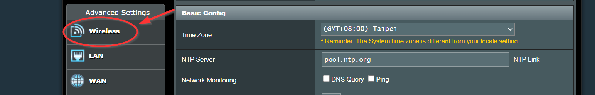

En primer lugar cambiamos el **SSID** por defecto y **lo ocultamos** para dificultar su detección.

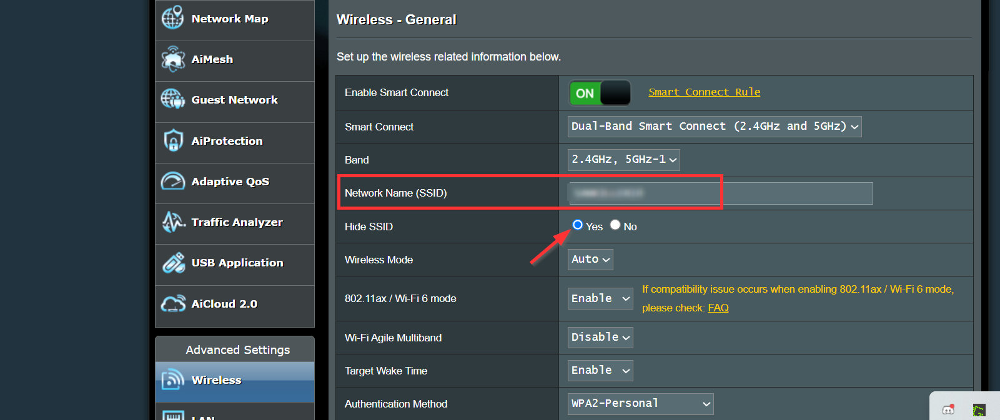

Luegp seleccionamos **WPA3-Personal** como método de autenticación.

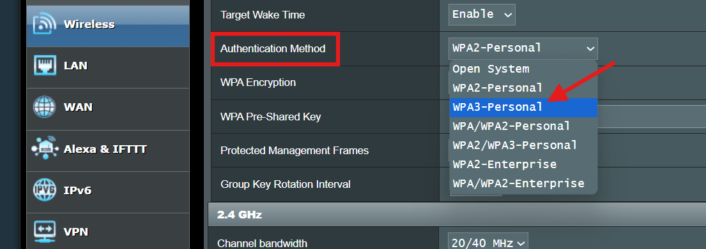

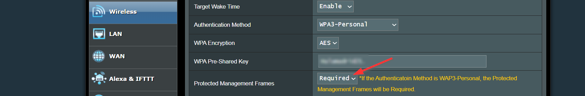

**Nota:** Al seleccionar **WPA3-Personal** debemos establecer los **Protected Management Frames** en **Required**. Si necesitarámos **compatibilidad con dispositivos antiguos** dejaremos el método de autenticación en **WPA2-Personal** con cifrado **AES**.

Por último cambiamos la **contraseña por defecto de la red Wi-Fi**. Deberíamos establecer una contraseña diferente a la que pusimos para el **login** para mayor seguridad.

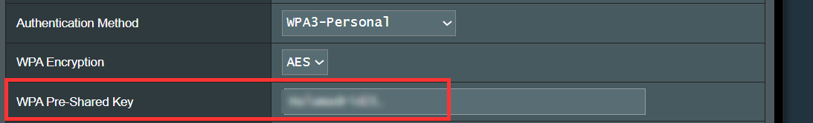

Pulsamos **Apply** para guardar los cambios.

## Segmentación de red
En primer lugar crearemos una **red para invitados**  de modo que los dispositivos de visitantes no tengan acceso a nuestra **red interna (Access Intranet > Disable)** ni a **dispositivos críticos**. 

Para ello vamos a **Guest Network** y la activamos en **2.4 ó 5 GHz** pulsando el botón **Enable**. En nuestro caso hemos escogido la opción de **2.4 GHz**. 

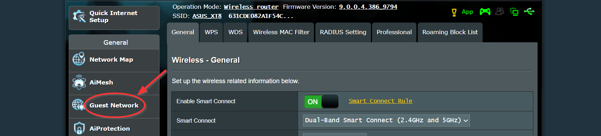

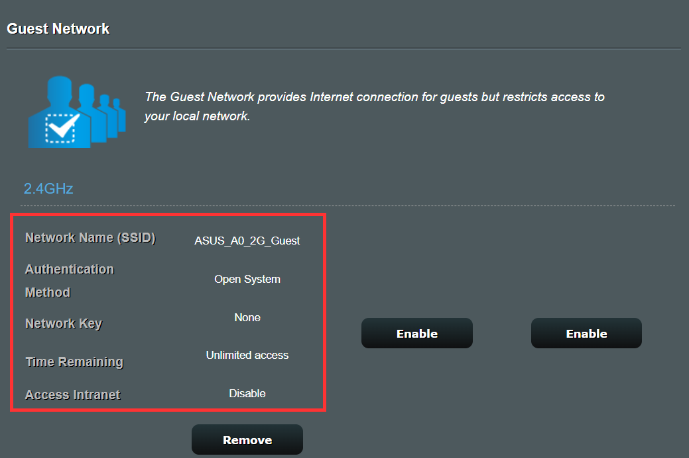

Ahora habilitaremos el **Aislamiento de clientes** para evitar que los clientes inalámbricos puedan comunicarse entre ellos y añadir así una capa extra de seguridad.

Para ello vamos a **Wireless > Professional** y habilitamos la opción **Set AP Isolated**.

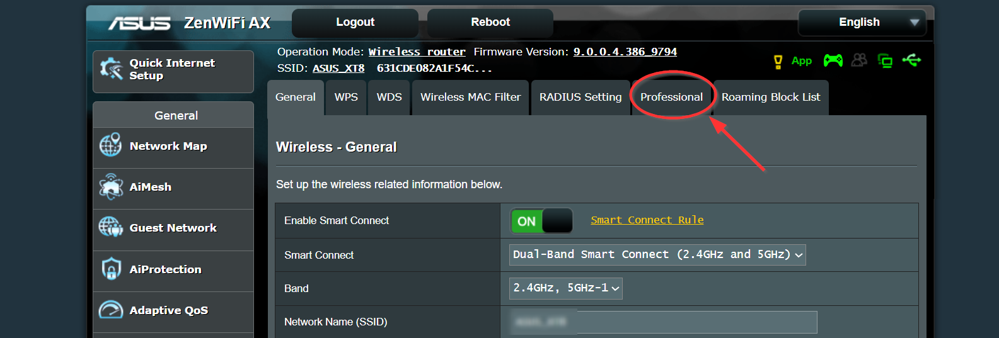

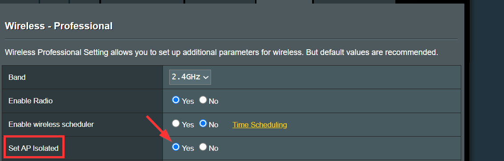

## Protección avanzada
Ahora nos vamos a **AiProtection > Network Protection** y habilitamos las siguientes características:

+ Protección contra intrusiones **(Two-Way IPS)**
- Bloqueo de sitios maliciosos **(Malicious Sites Blocking)**
+ Protección contra dispositivos infectados **(Infected Device Prevention and Blocking)**

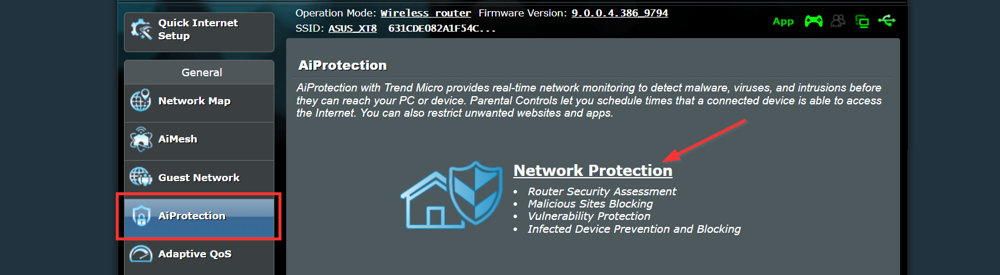

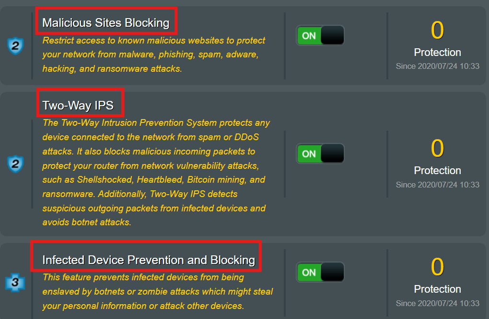

## Configuración del firewall
A continuación nos vamos a **Firewall > General** y habilitamos la protección contra ataques DoS **(DoS Protection)**:

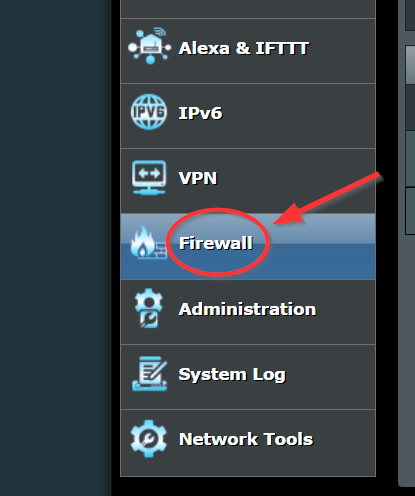

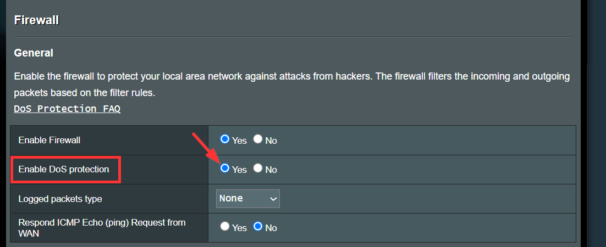

## Mantenimiento y Monitoreo
Podemos programar **reinicios periódicos** en **Administration > System > Reboot Scheduler** para **limpiar conexiones** y **minimizar los fallos de servicio**.

En nuestro caso programamos **reinicios** los **domingos** a las **03:00 AM**.

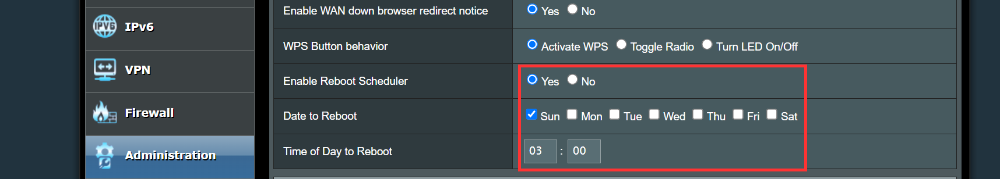

También tenemos la posibilidad de realizar **copias de seguridad de la configuración** en **Administration > Restore/Save/Upload Setting**.

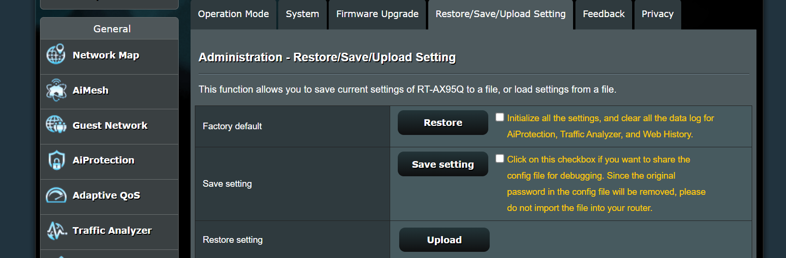

Para **guardar la configuración actual** tendremos que hacer clic en **Save setting**, mientras que para **cargar una configuración guardada** trndremos que pinchar en **Upload**.

También deberíamos acceder periódicamente al **registro (System Log)** y a la sección de **Network Map** para identificar **actividad inusual o dispositivos desconocidos**.

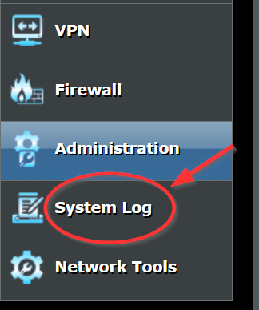

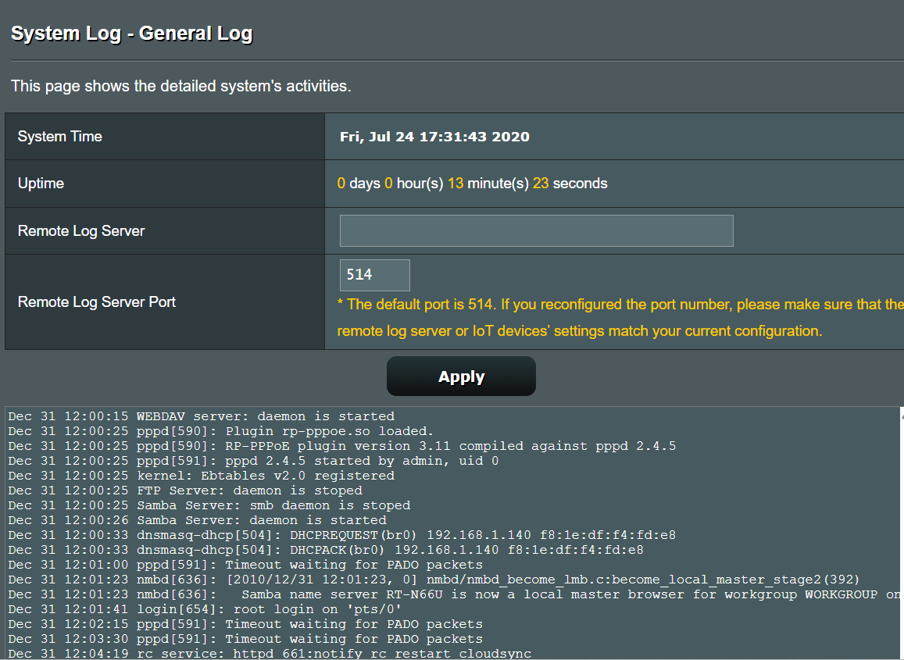

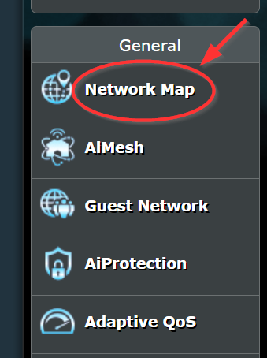

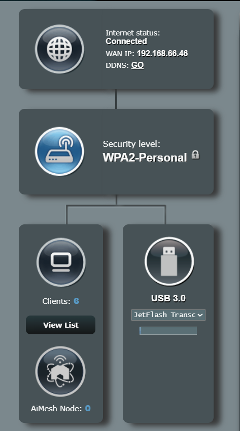

